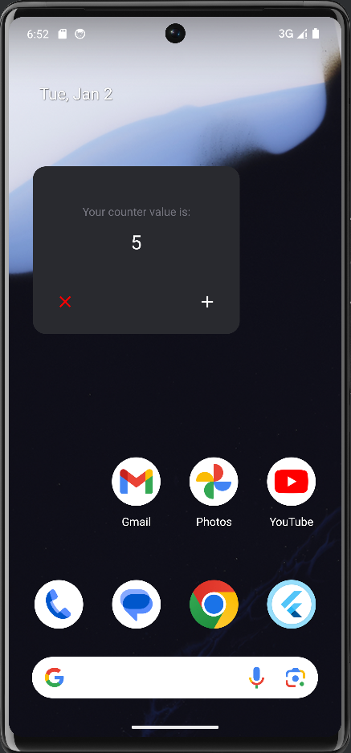
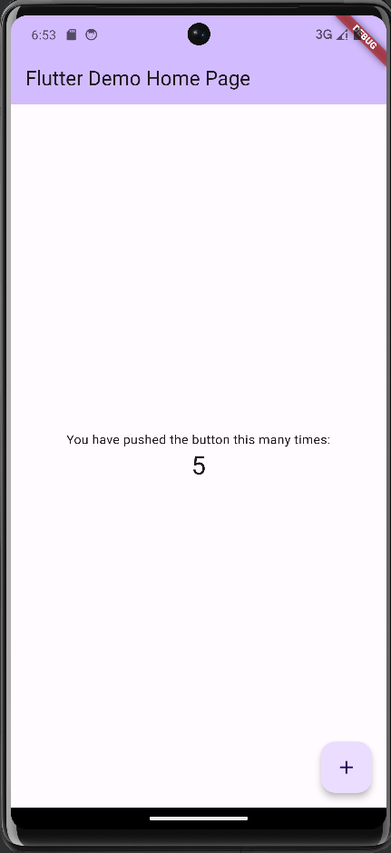

### app Function screenshot

<div style="display: flex">
    
    
</div>


### XML file

```xml
<!-- <LinearLayout
        android:layout_width="match_parent"
        android:layout_height="wrap_content"
        android:layout_weight="0"
        android:orientation="horizontal">

            <ImageButton
                android:id="@+id/button_clear"
                android:layout_width="wrap_content"
                android:layout_height="wrap_content"
                android:layout_gravity="center"
                android:layout_weight="0"
                android:background="#00000000"
                android:contentDescription="clear"
                android:padding="8dp"
                android:src="@drawable/baseline_close_24"
                android:tint="#FF0000" />

            <LinearLayout
                android:layout_width="wrap_content"
                android:layout_height="0dp"
                android:layout_weight="1" />

            <ImageButton
                android:id="@+id/bt_update"
                android:layout_width="wrap_content"
                android:layout_height="wrap_content"
                android:layout_weight="0"
                android:background="@drawable/fab_shape"
                android:contentDescription="increment"
                android:padding="8dp"
                android:src="@drawable/baseline_add_24"
                android:tint="#FFFFFF" />
        </LinearLayout> -->


   <Button
       android:id="@+id/bt_update"
       android:layout_width="match_parent"
       android:layout_height="wrap_content"
       android:layout_alignParentBottom="true"
       android:text="Update Counter"
       android:textColor="@android:color/holo_blue_dark"
       android:textSize="12sp" />


<FrameLayout
    android:id="@+id/widget_root"
    xmlns:android="http://schemas.android.com/apk/res/android"
    android:layout_width="180dp"
    android:layout_height="110dp">

    <RelativeLayout
        android:layout_width="match_parent"
        android:layout_height="match_parent"
        android:background="#1f303d">

        <TextView
            android:id="@+id/tv_counter"
            android:layout_width="wrap_content"
            android:layout_height="wrap_content"
            android:layout_alignParentTop="true"
            android:gravity="center_horizontal"
            android:padding="12dp"
            android:text="--"
            android:textColor="@android:color/white"
            android:textSize="16sp" />

        <ImageButton
            android:id="@+id/button_clear"
            android:layout_width="wrap_content"
            android:layout_height="wrap_content"
            android:layout_gravity="center"
            android:layout_weight="0"
            android:background="#00000000"
            android:contentDescription="clear"
            android:padding="8dp"
            android:src="@drawable/baseline_close_24"
            android:tint="#FF0000" />

        <LinearLayout
            android:layout_width="wrap_content"
            android:layout_height="0dp"
            android:layout_weight="1" />

        <ImageButton
            android:id="@+id/bt_update"
            android:layout_width="wrap_content"
            android:layout_height="wrap_content"
            android:layout_weight="0"
            android:background="@drawable/fab_shape"
            android:contentDescription="increment"
            android:padding="8dp"
            android:src="@drawable/baseline_add_24"
            android:tint="#FFFFFF" />
    </RelativeLayout>
</FrameLayout>
```